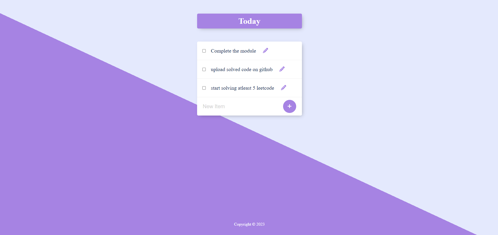

# Permalist

Permalist is a web application designed for managing your tasks. You can easily add new tasks, mark them as completed, and remove tasks from your list. This app utilizes PostgreSQL and ExpressJS to make task management a breeze.

## Technologies Used

The following technologies and tools were used to develop this project:

- HTML
- CSS
- JavaScript
- Node.js
- Express.js
- PostgreSQL
- EJS (Embedded JavaScript)

## Getting Started

Follow these steps to get the project up and running on your local machine for development and testing:

### Prerequisites

Make sure you have the following requirements met:

- Latest version of npm, Node.js, and postgreSQL installed.
- Windows/Linux/Mac machine.

### Installation

To run permalist locally, follow these steps:

1. Clone the repository

   ```bash
   git clone https://github.com/username/projectname.git
   ```

2. Move into the project directory

   ```bash
   cd projectname
   ```

3. Install the dependencies

   ```bash
   npm install
   ```

4. Create a database named `permalist`.

5. Copy `queries.sql` and paste it into queries tab of postgreSQL

6. Configure the database by filling in the `password` in `index.js` on line 12:

   ```javascript
   const db = new pg.Client({
     user: "postgres",
     host: "localhost",
     database: "permalist",
     password: "",
     port: 5432,
   });
   ```

7. Run the application:

   ```bash
   node index.js
   ```

8. Open your web browser and navigate to `http://localhost:3000` to access the website.

### How to Use

Follow these steps to make the most of this permalist application:

1. Start by viewing the default permalist, which comes with some sample tasks.
2. To add a new task, simply type it into the input field and click the "+" button.
3. When a task is completed, check the checkbox next to it. This will delete the task.
4. If you want to edit a task, click the "pen" symbol next to the task & edit the task.

## Screenshots



## Contributing

Contributions to this projects are welcome! To contribute, follow these steps:

1. Fork the repository.
2. Create a new branch for your feature or bug fix:

```bash
git checkout -b feature/your-feature-name
```

3. Make changes and commit them:

```bash
git commit -m "Add your commit message here"
```

4. Push your changes to your branch:

```bash
git push origin feature/your-feature-name
```

5. Create a pull request on the main repository.

Please follow the project's coding guidelines and maintain a clean commit history.

## License

This website is licensed under the MIT License. See the [LICENSE](LICENSE) file for details.

## Contact

If you have any questions or feedback, feel free to reach out to me at therahman14@gmail.com. I'm excited to hear from you and make this project even better!
